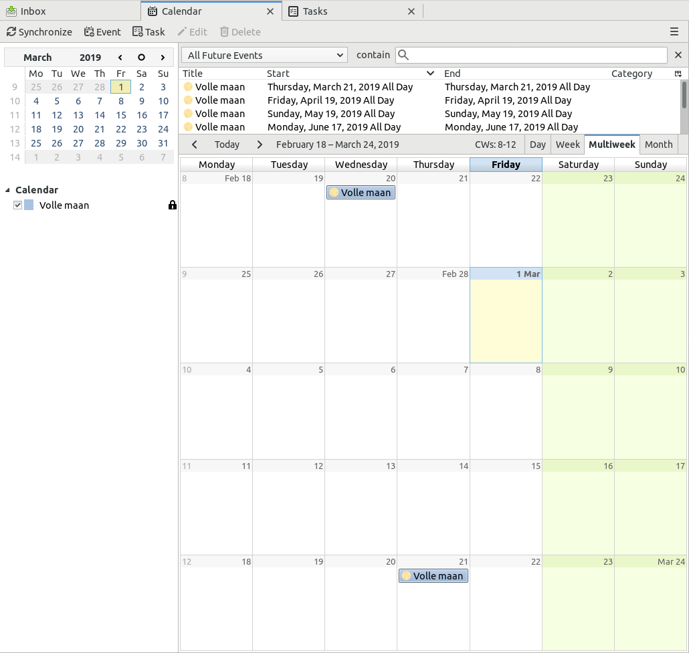
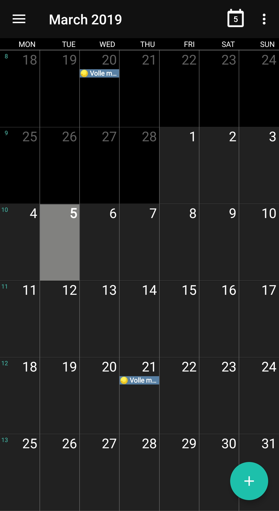

# Lunar Phase Calendar

Rolling ICS calendars with [lunar phases](https://en.wikipedia.org/wiki/Lunar_phase) for five years in advance.

> <em>Ignorance is the night of the mind, but a night without moon and star.</em> — Confucius (551 – 479 BC) Chinese philosopher and reformer

Besides calendars with all the lunar phases, there are also calendars provided with only the dates when there is a new or full moon. The calendars are generated for many [country](https://en.wikipedia.org/wiki/ISO_3166-1_alpha-2)-[language](https://en.wikipedia.org/wiki/List_of_ISO_639_language_codes) combinations in different file formats:
- tab-separated format in TSV files, e.g. `GB/en/moon-phases.tsv`
- MarkDown in MD files, e.g. `BE/nl/new-moon.md`
- iCalendar in ICS files, e.g. `AT/de/full-moon.ics`

See the file [countries.json](countries.json) for which country-language combinations are supported. Even though the moon phase is the same all over the world, [time zones](https://en.wikipedia.org/wiki/List_of_tz_database_time_zones) per country need to be taken into consideration.

The calendars are generated on a certain day for five years in advance and is published in this repository. At the time of generation, a margin is used of six months at the beginning and of three months at the end.

As lunar phases cannot be written in recurring calendar events, all the individual lunar phases need to be included in the calendar. Generating calendars for the next ten of fifty years would results in large ICS files. Hence, this approach was chosen.

The calendars will be regenerated regularly. Browse around in order to find the lunar phase calendar you are looking for. In case a calendar is lagging behind too much, more time in advance is needed, you want to contribute a translation or report a bug or feature, please create an issue.

## Screenshots

## Calendar Software

Probably, you already have software installed for using online calendars. If that is not the case, lunar phase calendars can be shown with:

| Name              | Android | iOS | macOS | Windows | Linux | Web |
|-------------------|:-------:|:---:|:-----:|:-------:|:-----:|:---:|
| Google Calendar   | [✔](https://play.google.com/store/apps/details?id=com.google.android.calendar) | [✔](https://apps.apple.com/app/google-calendar-get-organized/id909319292) | - | - | - | [✔](https://google.com/calendar) |
| ICSx⁵             | [✔](https://play.google.com/store/apps/details?id=at.bitfire.icsdroid) | - | - | - | - | - |
| Thunderbird       | [✔](https://play.google.com/store/apps/details?id=net.thunderbird.android) | - | [✔](https://www.thunderbird.net) | [✔](https://www.thunderbird.net) | [✔](https://www.thunderbird.net) | - |
| NextCloud         | [✔](https://play.google.com/store/apps/details?id=com.nextcloud.client) | [✔](https://apps.apple.com/us/app/nextcloud/id1125420102) | ✔ | ✔ | ✔ | ✔ |
| Apple Calendar    | - | ✔ | ✔ | - | - | [✔](https://www.apple.com/icloud/#ccm) |
| Microsoft Outlook | [✔](https://play.google.com/store/apps/details?id=com.microsoft.office.outlook) | [✔](https://www.apple.com/search/outlook) | [✔](https://www.apple.com/search/outlook) | [✔](https://products.office.com/outlook) | - | [✔](https://outlook.com) |

ICSx⁵ can also be found in the [F-Droid](https://f-droid.org/repository/browse/?fdfilter=calendar&fdid=at.bitfire.icsdroid) app store. Do **not** use software that can only import ICS files.

## Using ICS Files in Calendar Software

First, choose the ICS calendar file on GitHub you would like to add to your calendar software. Browse under Code to e.g. `en` and choose e.g. `full-moon.ics`. Then, click on the button called Raw and you will go to the URL for this calendar. For this example, `https://raw.githubusercontent.com/PanderMusubi/lunar-phase-calendar/master/GB/en/full-moon.ics` will be the URL.

After you have copied the URL of an ICS file, please paste this in your calendar software when adding a (read-only) online network or ICS calendar. Sometimes this is called to subscribe to a calendar. Usually you can choose how often synchronization has to be done to keep your lunar phase calendar up to date. Set this to 24 hours, because there are not that many updates. Again, do **not** choose the (one time) import of the ICS calendar as it will not update itself.

## Emoji

Emoji support moon phases, hence the following Unicode characters are use in the output files:
1. 🌑 [`U+1F311`](https://emojipedia.org/new-moon-symbol/) New moon
2. 🌒 [`U+1F312`](https://emojipedia.org/waxing-crescent-moon-symbol/) Waxing crescent
3. 🌓 [`U+1F313`](https://emojipedia.org/first-quarter-moon-symbol/) First quarter
4. 🌔 [`U+1F314`](https://emojipedia.org/waxing-gibbous-moon-symbol/) Waxing gibbous
5. 🌕 [`U+1F315`](https://emojipedia.org/full-moon-symbol/) Full moon
6. 🌖 [`U+1F316`](https://emojipedia.org/waning-gibbous-moon-symbol/) Waning gibbous
7. 🌗 [`U+1F317`](https://emojipedia.org/last-quarter-moon-symbol/) Last quarter
8. 🌘 [`U+1F318`](https://emojipedia.org/waning-crescent-moon-symbol/) Waning crescent

## Development

Generate a new calendar by installing the required package with

    pip install -Ur requirements/use.txt

and run

    ./generate.py

Use https://icalendar.org/validator.html and https://icalvalidator.com/index.html to validate the generated calendars.

For development purposes and before running `lint.sh`, do

    sudo apt-get -y install devscripts
    pip install -Ur requirements/dev.txt

Translation are welcome via PR for the files [countries.json](countries.json), [headers.json](headers.json) and [moon-phase-names.json](moon-phase-names.json).

## See also

See also https://github.com/PanderMusubi/dutch-holidays and https://github.com/commenthol/date-holidays-ical for calendars related to holidays.

The lunar phase data used here is from the Python package [astral](https://astral.readthedocs.io/en/latest/index.html#moon). Its maintainer made a in the documentation of it a reference back to this project as a showcase of it usage. Many thanks for this.
